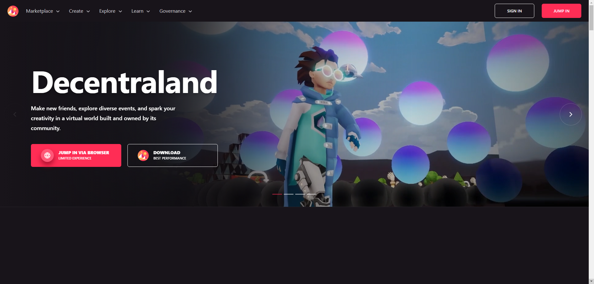
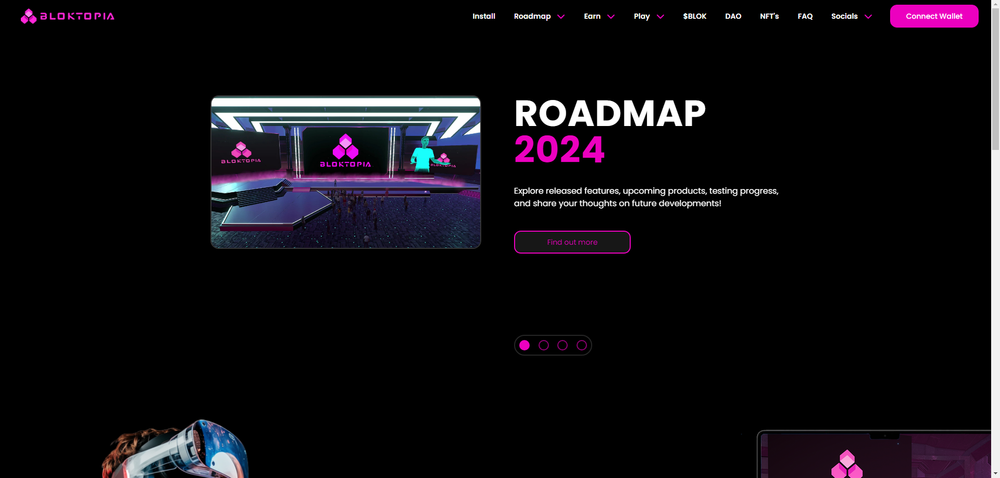
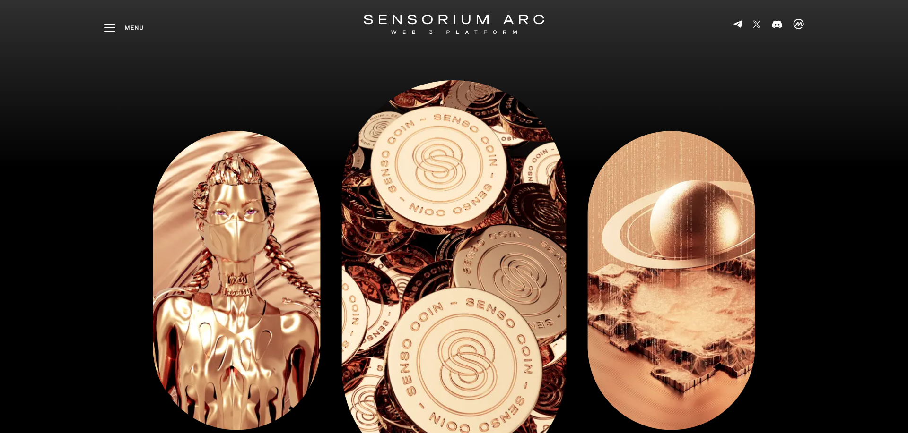
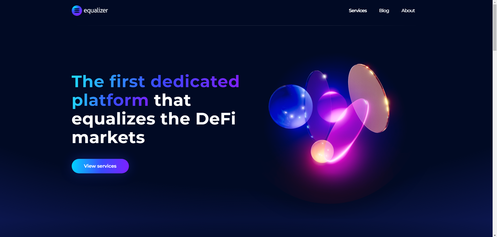
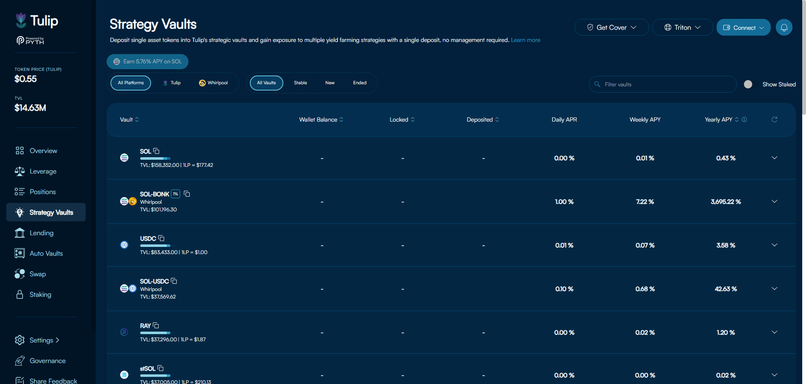
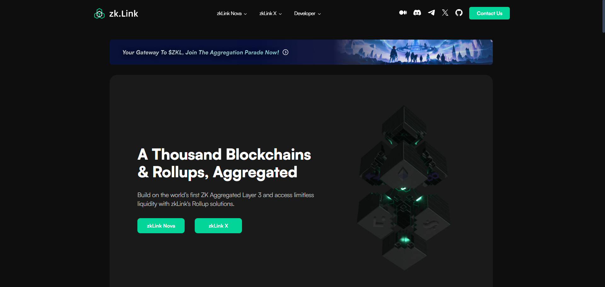

# Welcome to Andres Espinoza's GitHub 👋

Hello! I'm **Andres Espinoza** 🇦🇷, a passionate developer and researcher from Argentina specializing in Blockchain 🔗, Bot Development 🤖, and Artificial Intelligence 🧠. Here, you'll find a collection of my open-source projects, contributions, and ongoing research. Join me on this exciting journey of innovation and technology! 🚀

---

## 🚀 About Me

1.  🔭 **Currently working on**: Developing advanced blockchain solutions, creating AI-driven bots, and exploring new applications of artificial intelligence.
2.  🌱 **Learning**: Continuously expanding my knowledge in decentralized finance (DeFi) systems, new AI algorithms, and the latest in bot development frameworks.
3.  💬 **Ask me about**: Blockchain technology, smart contracts, machine learning, natural language processing, and bot development. I'm always excited to discuss innovative tech solutions and collaborate on interesting projects.
4.  🌟 **Fun Fact**: I'm a big fan of science fiction and love exploring how today's technology might shape our future.

---

## 📂 Portfolio

  
  <h2><a href="https://tito-portfolio-nine.vercel.app" target="_blank">Visit My Portfolio</a></h2>

### 3. Artificial Intelligence 🧠

#### - Languages 🌐

  
  
  

#### - Frameworks & Libraries 📚

  
  
  
  
  
  
  
  

### 4. Full Stack Development 🌐

#### - Languages 🌐

  
  
  
  
  
  
  

#### - Frontend Frameworks & Libraries 📚

  
  
  
  
  

#### - Backend Frameworks & Libraries 📚

  
  
  
  
  

#### - Databases 🗄️

  
  
  
  
  

#### - DevOps Tools 🚀

  
  
  
  
  
  
  
  

## 💼 Projects

  <!-- Project 1 -->
  

    
    <h2 align="center" style="font-size: 1.5em;"><a href="https://decentraland.org" target="_blank">Decentraland</a></h2>
    
A virtual reality platform powered by blockchain. Decentraland allows users to create, experience, and monetize content and applications.

    
**Technologies**: Ethereum blockchain, Solidity smart contracts, Three.js

  

  <!-- Project 2 -->
  

    
    <h2 align="center" style="font-size: 1.5em;"><a href="https://bloktopia.com" target="_blank">Bloktopia</a></h2>
    
Bloktopia is a blockchain-based game platform where players can buy, sell, and trade virtual assets securely using blockchain technology.

    
**Technologies**: Ethereum blockchain, ERC-721 tokens, Unity

  

  <!-- Project 3 -->
  

    
    <h2 align="center" style="font-size: 1.5em;"><a href="https://sensoriumarc.com/" target="_blank">Sensorium</a></h2>
    
Sensorium is an AI-driven platform that provides immersive sensory experiences in virtual environments, powered by blockchain technology for security and transparency.

    
**Technologies**: Artificial Intelligence, Unity, Blockchain

  

  <!-- Project 4 -->
  

    
    <h2 align="center" style="font-size: 1.5em;"><a href="https://equalizer.finance/" target="_blank">Equalizer Finance</a></h2>
    
Equalizer Finance is a decentralized finance (DeFi) platform that aims to provide financial equality through innovative DeFi products and services.

    
**Technologies**: Ethereum blockchain, Solidity smart contracts, Web3.js

  

  <!-- Project 5 -->
  

    
    <h2 align="center" style="font-size: 1.5em;"><a href="https://tulip.garden/" target="_blank">Tulip Garden</a></h2>
    
Tulip Garden is a virtual garden platform where users can create, customize, and trade virtual flowers using blockchain technology for ownership and authenticity.

    
**Technologies**: Ethereum blockchain, ERC-721 tokens, React.js

  

  <!-- Project 6 -->
  

    
    <h2 align="center" style="font-size: 1.5em;"><a href="https://zk.link/" target="_blank">zk.link</a></h2>
    
zk.link is a platform for zero-knowledge proof technologies, providing tools and resources for developers to implement privacy-preserving solutions.

    
**Technologies**: Zero-Knowledge Proofs, Cryptography, Web3.js

  

## 💼 Experience

### Senior Blockchain Developer | Blockchain Innovations Ltd.

_February 2018 - January 2024_

-   Led development projects focused on Solana blockchain, overseeing the implementation of custom smart contracts and decentralized applications (dApps).
-   Collaborated with cross-functional teams to design and deploy innovative blockchain solutions tailored to client requirements.
-   Conducted security audits and code reviews to ensure the robustness and reliability of smart contracts and blockchain systems.
-   Contributed to the research and development of new blockchain technologies and protocols, staying abreast of industry trends and best practices.

### Lead Bot Developer | TechBot Solutions

_July 2015 - January 2018_

-   Designed and developed custom bots for various platforms, including Discord, Telegram, and Twitter, aimed at automating tasks and enhancing user experiences.
-   Implemented natural language processing (NLP) algorithms and machine learning techniques to improve bot functionality and intelligence.
-   Worked closely with clients to understand their needs and translate requirements into scalable bot solutions.
-   Provided ongoing maintenance and support for deployed bots, addressing any issues and implementing feature updates as necessary.

## 🌟 Contributions

I am passionate about contributing to open-source projects and collaborating with other developers. Here are some ways you can get involved:

-   Submit issues and feature requests for any of my projects.
-   Fork and submit pull requests to improve the codebase.
-   Share feedback and suggestions to help enhance the projects.

---

## 🏆 Recognition

I am honored to have received recognition for my contributions to the tech community:

-   **Top Contributor** on multiple blockchain and AI-related repositories.
-   **Speaker** at various tech conferences and meetups, sharing insights on blockchain, AI, and bot development.
-   **Mentor** for aspiring developers in the fields of blockchain and AI.

---

## 📜 License

All my open-source projects are released under the [MIT License](https://opensource.org/licenses/MIT). You are free to use, modify, and distribute my work as long as you include proper attribution.

---

## 🙏 Thank You!

Thank you for visiting my GitHub profile! If you have any questions or would like to collaborate on a project, feel free to reach out to me. Let's innovate and create something amazing together!

---
